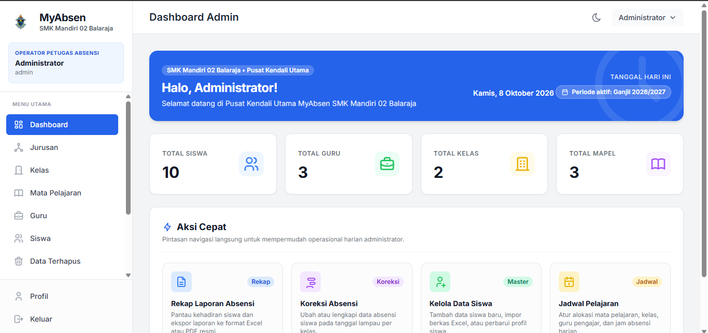
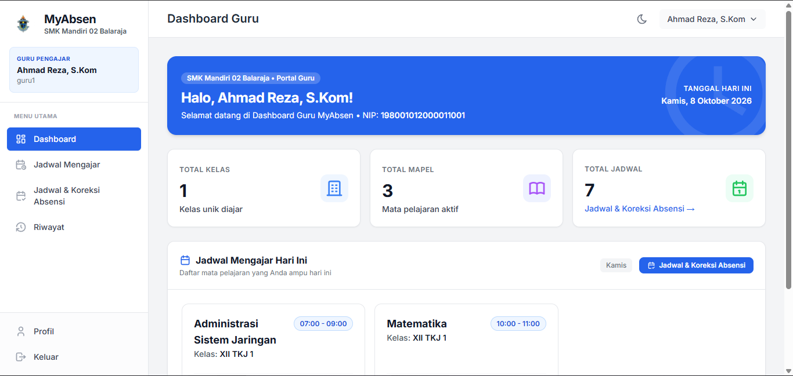
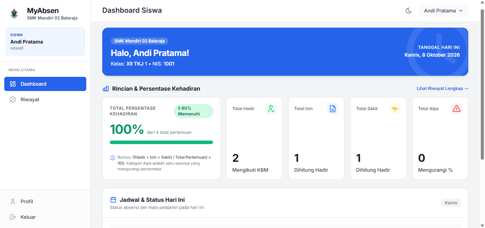

# 🏫 MyAbsen

> **Aplikasi Absensi Siswa per Mata Pelajaran untuk SMK**

MyAbsen adalah sistem informasi absensi siswa berbasis web yang dirancang khusus untuk Sekolah Menengah Kejuruan (SMK) sebagai proyek PKM. Berbeda dengan absensi harian biasa, sistem ini mencatat kehadiran **per mata pelajaran**, memungkinkan pelacakan kehadiran siswa di setiap jam pelajaran secara akurat.

---

## 📑 Daftar Isi
- [Fitur Utama](#-fitur-utama)
- [Visual Preview](#-visual-preview)
- [Teknologi](#-teknologi)
- [Panduan Instalasi Lokal](#-panduan-instalasi-lokal)
- [Kredensial Demo](#-kredensial-demo)
- [Pembaruan (Git Pull)](#-pembaruan-setelah-git-pull)
- [Perintah Penting](#-perintah-penting)
- [Panduan Seeder & Migrasi (Lokal vs Produksi)](#-panduan-seeder--migrasi-lokal-vs-produksi)
- [Variabel Environment Tambahan (.env)](#️-variabel-environment-tambahan-env)
- [Pemecahan Masalah](#-pemecahan-masalah)
- [Dokumentasi Proyek](#-dokumentasi-proyek)
- [Alur Kerja Tim](#-alur-kerja-tim)

---

## ✨ Fitur Utama

Aplikasi ini memiliki tiga peran utama dengan batasan akses masing-masing, serta dilengkapi fitur aksesibilitas tingkat lanjut:

### 🌟 Fitur Unggulan (Baru)
- **Otentikasi Fleksibel:** Pengguna dapat login menggunakan Username bawaan, ATAU menggunakan Nomor Induk (NIP untuk Guru, NIS untuk Siswa).
- **Aksesibilitas Visual:** Dilengkapi *toggle* Light Mode dan Dark Mode untuk kenyamanan mata pengguna dari berbagai rentang usia (default: Light Mode).

### 👑 Admin
- **Master Data:** Mengelola data jurusan, kelas, mata pelajaran, guru, dan siswa dengan perlindungan riwayat data (soft delete).
- **Manajemen Jadwal:** Mengatur jadwal pelajaran dengan validasi pencegahan jadwal bentrok, filter komprehensif (hari, kelas, guru, mapel, rentang jam), dan pencarian terpadu.
- **Import Data:** Memasukkan data siswa secara massal melalui file Excel.
- **Menu Koreksi Absensi:** Meninjau jadwal dan status sesi absensi pada tanggal lampau per kelas serta membuka form koreksi/susulan.
- **Pengaturan Periode:** Mengelola tahun ajaran aktif dan semester aktif langsung dari antarmuka web dengan saran otomatis kalender dan modal konfirmasi pergantian.
- **Pergantian Periode:** Mengelola transisi tahun ajaran dan semester baru dalam satu halaman terpadu: panduan alur kerja dan status periode aktif, salin struktur kelas antar-periode (otomatis lewati kelas yang sudah ada), pemindahan massal siswa antar-kelas dengan filter pencarian real-time, serta kelulusan massal siswa kelas akhir (soft delete aman tanpa menghapus akun user, terintegrasi dengan pemulihan Data Terhapus).
- **Data Terhapus (Arsip):** Meninjau data master yang telah di-soft-delete (Guru, Siswa, Kelas, Mapel) dalam 4 tab dan memulihkannya kembali secara aman dengan validasi dependensi dan pencegahan bentrok.
- **Laporan & Ekspor:** Mengunduh rekap absensi sekolah dalam format Excel (multi-sheet per kelas-mapel) dan dokumen cetak PDF dengan batasan aman serta filter jurusan dan bulan.

### 👨‍🏫 Guru
- **Dashboard Cerdas:** Menampilkan jadwal mengajar pada hari tersebut, ringkasan total mengajar, dan kartu pengingat jadwal belum diabsen dalam 7 hari terakhir yang melewati jam tayang.
- **Jadwal Mengajar:** Jadwal mingguan guru dengan filter hari dan sorotan visual pada hari pelaksanaan hari ini.
- **Absensi Cepat:** Sistem memberikan status default **Hadir** untuk seluruh kelas. Guru hanya mengubah status siswa yang *Izin*, *Sakit*, atau *Alpa*.
- **Menu Jadwal & Koreksi Absensi:** Mengakses jadwal mengajar dan mengoreksi/mengisi susulan absensi dalam jendela **7 hari terakhir** (hari ini s.d. H-6 yang harinya cocok).
- **Riwayat & Laporan:** Meninjau riwayat kehadiran per kelas & mapel dalam format matriks per pertemuan (P1..Pn) dengan penanda kehadiran rendah ("Perlu perhatian") bagi siswa di bawah ambang batas kehadiran, serta mengekspor rekap kelas yang diampu ke format Excel.

### 🎓 Siswa (Read-Only)
- **Monitoring Pribadi:** Melihat status kehadiran harian per mata pelajaran secara langsung.
- **Jadwal Pelajaran:** Mengakses jadwal pelajaran mingguan kelas pada periode aktif yang dikelompokkan per hari urut jam pelajaran, lengkap dengan filter hari dan sorotan hari ini.
- **Statistik & Riwayat:** Melacak persentase tingkat kehadiran (kalkulasi positif: Hadir, Izin, dan Sakit; Alpa sebagai pengurang) dan riwayat lengkap dengan filter status kehadiran (Hadir, Izin, Sakit, Alpa), tanggal, mapel, dan periode.

---

## 📸 Visual Preview

Antarmuka MyAbsen dirancang dengan estetika modern, bersih, dan intuitif menggunakan **Tailwind CSS**, tipografi **Inter** untuk kenyamanan membaca optimal, serta set ikon konsisten dari **Tabler Icons**. Sistem ini juga mendukung mode tampilan *Light Mode* dan *Dark Mode* untuk kenyamanan visual seluruh pengguna.

### 1. Dashboard Admin
Menyajikan ringkasan statistik master data sekolah (siswa, guru, kelas, mapel), status absensi hari ini, pintasan koreksi absensi, dan kontrol cepat pengaturan periode aktif.



### 2. Dashboard Guru
Menampilkan sapaan jadwal mengajar hari ini, rekapitulasi total jam ajar, navigasi cepat ke form pengisian absensi kelas, dan status kelengkapan presensi.



### 3. Dashboard Siswa
Menyediakan pemantauan kehadiran mandiri siswa, kartu statistik persentase kehadiran transparan (kalkulasi positif Hadir, Izin, Sakit), dan rincian status kehadiran per mata pelajaran.



---

## 🛠️ Teknologi

Proyek ini dibangun menggunakan *stack* teknologi berikut (sesuai dengan aturan proyek):

- **Backend:** Laravel 12, PHP 8.3+
- **Pola Arsitektur (Separation of Concerns):**
  - **Thin Controller:** Menerima request HTTP, mendelegasikan proses ke Service, dan mengembalikan response atau view.
  - **FormRequest:** Khusus memvalidasi integritas input pengguna di sisi server.
  - **Policy (`JadwalPolicy`):** Memusatkan otorisasi hak akses guru dan hak koreksi historis admin.
  - **Service Pattern (`AbsensiService`, `LaporanService`, & `ArsipService`):** Pusat seluruh *business logic*, transaksi absensi, kalkulasi persentase kehadiran, ekspor laporan, pemulihan data terhapus, dan helper waktu server `Asia/Jakarta`.
  - **Model:** Khusus menangani *relationships*, *query scopes*, dan *persistence concerns* (termasuk *soft deletes*).
  - **View:** Blade Templating dengan Tailwind CSS dan Alpine.js untuk layer presentasi.
- **Database:** MySQL 8
- **Frontend:** Blade Templating, Tailwind CSS, Alpine.js
- **Autentikasi:** Laravel Breeze (Blade)
- **Testing:** Pest dan PHPUnit (Feature & Unit Testing)
- **Library Tambahan:** `maatwebsite/excel` (Export/Import Excel), `barryvdh/laravel-dompdf` (Export PDF)

---

## 🚀 Panduan Instalasi Lokal

Ikuti langkah-langkah di bawah ini untuk menjalankan proyek di komputer lokal bagi anggota tim pengembangan.

### Prasyarat
Pastikan komputer Anda sudah terinstal:
- PHP 8.3 atau lebih baru
- Composer
- Node.js & NPM
- MySQL (Direkomendasikan menggunakan [Laragon](https://laragon.org) untuk pengguna Windows)
- Git

### Langkah Instalasi

1. **Siapkan Database**
   Nyalakan MySQL (di Laragon, klik **Start All**), lalu buat dua database kosong:
   - `myabsen` (untuk database aplikasi utama)
   - `myabsen_test` (untuk database pengujian otomatis)

2. **Clone Repository**
   ```bash
   git clone https://github.com/iwp10/myabsen.git
   cd myabsen
   ```

3. **Install Dependensi Backend & Frontend**
   ```bash
   composer install
   npm install
   ```

4. **Konfigurasi Environment**
   Salin file konfigurasi dan generate application key:
   ```bash
   copy .env.example .env
   php artisan key:generate
   ```
   *(Untuk pengguna macOS/Linux atau Git Bash, gunakan `cp .env.example .env`)*

   > **Catatan Database:** File `.env.example` bawaan menggunakan user MySQL `root` tanpa password (standar Laragon). Jika pengaturan MySQL Anda berbeda, sesuaikan `DB_USERNAME` dan `DB_PASSWORD` di file `.env` Anda.

5. **Migrasi Database & Data Demo**
   Jalankan perintah berikut untuk membuat struktur tabel dan mengisi data awal (seeder):
   ```bash
   php artisan migrate --seed
   ```

6. **Kompilasi Aset Frontend**
   Pilih salah satu dari perintah berikut:
   - `npm run build` : Dijalankan sekali, cukup untuk menjalankan aplikasi.
   - `npm run dev` : Dibiarkan berjalan (di terminal terpisah), gunakan saat Anda sedang mengedit file tampilan (Blade/CSS/JS).

7. **Jalankan Aplikasi**
   Buka terminal baru dan jalankan server lokal Laravel:
   ```bash
   php artisan serve
   ```

8. **Akses Web**
   Buka browser dan akses: `http://127.0.0.1:8000`

---

## 🔑 Kredensial Demo


Gunakan akun berikut untuk mencoba fitur-fitur aplikasi selama tahap pengembangan lokal. 

| Role | Username / Nomor Induk | Password |
|---|---|---|
| Admin | `admin` | `password` |
| Guru | `guru1` ATAU `198001012000011001` | `password` |
| Siswa | `siswa1` ATAU `1001` | `password` |

> 💡 **Info:** Anda bisa mencoba fleksibilitas login dengan memasukkan NIP atau NIS pada kolom Username saat login.
> ⚠️ **Peringatan:** Akun ini hanya untuk *development*. Jangan gunakan kredensial ini di server produksi.

---

## 🔄 Pembaruan (Setelah `git pull`)

Ketika Anda menarik pembaruan terbaru dari repository (`git pull`), jalankan perintah berikut sesuai dengan perubahan yang ada:

- Jika `composer.lock` berubah: `composer install`
- Jika `package.json` atau `package-lock.json` berubah: `npm install`
- Jika ada file migration baru: `php artisan migrate`

> **Tips:** Jika ragu, jalankan ketiganya. Menjalankan perintah ini berulang kali tidak akan merusak sistem.

---

## 💻 Perintah Penting

| Perintah | Deskripsi |
|---|---|
| `php artisan test` | Menjalankan *test suite* (Feature & Unit tests). Berjalan menggunakan database MySQL `myabsen_test` (sesuai konfigurasi `phpunit.xml`) sehingga **tidak akan menghapus** data di database utama `myabsen`. |
| `php vendor/bin/pint` | Merapikan format kode PHP (Code Style). **Wajib dijalankan sebelum commit.** |
| `php artisan migrate:fresh --seed` | Menghapus seluruh tabel dan melakukan instalasi ulang database beserta data demo (Hanya untuk lokal/dev!). |
| `php artisan config:clear` | Membersihkan cache konfigurasi (jalankan setiap kali Anda mengubah file `.env`). |
| `npm run build` | Melakukan build aset *frontend* untuk produksi. |

---

## 🏭 Panduan Seeder & Migrasi (Lokal vs Produksi)

### 💻 Lingkungan Lokal (Development)
Untuk menyiapkan database lokal beserta akun dan data demo lengkap:
```bash
php artisan migrate:fresh --seed
```
*Di non-produksi, `DatabaseSeeder` otomatis menjalankan `DemoSeeder` yang mengisi data demo (admin, guru, siswa, kelas, jadwal, dan riwayat absensi).*

### 🚀 Lingkungan Produksi (Deployment)
Jalankan migrasi dan inisialisasi akun administrator tunggal:
```bash
php artisan migrate --force
php artisan db:seed --class=AdminSeeder --force
```

> ⚠️ **PERINGATAN KERAS:** **Jangan pernah menjalankan `migrate:fresh` di server produksi!** `migrate:fresh` menghapus permanen seluruh tabel dan histori absensi.
> 💡 **Proteksi Otomatis:** `DemoSeeder` secara otomatis menolak dieksekusi jika dijalankan pada environment `production` (`APP_ENV=production`).

---

## ⚙️ Variabel Environment Tambahan (.env)

Konfigurasikan variabel berikut di file `.env` untuk keamanan akun produksi:

| Variabel | Deskripsi | Aturan Produksi |
|---|---|---|
| `ABSENSI_PASSWORD_AWAL` | Password default untuk pembuatan guru/siswa baru & reset password oleh admin. | Wajib minimal 8 karakter dan bukan `password`. |
| `ABSENSI_BATAS_KEHADIRAN_RENDAH` | Ambang batas persentase kehadiran siswa yang memerlukan perhatian khusus di riwayat guru (dalam persen). | Opsional (default: `75`). |
| `ADMIN_NAME` | Nama akun administrator awal untuk `AdminSeeder`. | Opsional (default: `Administrator`). |
| `ADMIN_USERNAME` | Username administrator awal untuk `AdminSeeder`. | Opsional (default: `admin`). |
| `ADMIN_PASSWORD` | Password administrator awal untuk `AdminSeeder`. | Minimal 12 karakter dan bukan `password`. Jika kosong, dibuat acak 16 karakter dan ditampilkan sekali di terminal. |

Setiap akun yang dibuat melalui seeder atau admin akan diberi kewajiban ganti password (`must_change_password`) saat login pertama kali.

---

## 🛠️ Pemecahan Masalah

| Kendala / Gejala | Solusi |
|---|---|
| `Unknown database 'myabsen'` atau `'myabsen_test'` | Anda belum membuat database di MySQL, atau konfigurasi DB di `.env` belum benar. Pastikan DB `myabsen` dan `myabsen_test` ada di MySQL, lalu jalankan `php artisan config:clear`. |
| `Connection refused` | Server MySQL belum menyala. Pastikan servis MySQL berjalan (klik Start All di Laragon). |
| Login gagal (Credentials do not match) | Anda belum menjalankan seeder. Jalankan `php artisan migrate --seed`. |
| Tampilan berantakan (tanpa CSS) | Aset belum dikompilasi. Jalankan `npm run build` atau `npm run dev`. |
| Peringatan PDO `PDO::MYSQL_ATTR_SSL_CA` | Ini hanya *warning* bawaan PHP 8/MySQL 8, bisa diabaikan. |

---

## 📚 Dokumentasi Proyek

Sebelum mulai menulis kode, tim wajib membaca dokumen berikut:

- [`AGENTS.md`](AGENTS.md) - Aturan wajib (Stack, Konvensi Kode, Git) untuk tim developer dan AI Assistant (Antigravity).
- [`docs/PRD.md`](docs/PRD.md) - Product Requirements Document (Sumber kebenaran fitur, aturan bisnis, dan skema database).
- [`docs/PROGRESS.md`](docs/PROGRESS.md) - Status pengerjaan tiap fase, tracking tugas, dan pembagian kerja tim.

---

## 🤝 Alur Kerja Tim

1. Selalu mulai dari branch utama: `git checkout main` lalu `git pull`. Setelah `git pull`, jika ada migration baru selalu jalankan: `php artisan migrate`.
2. Buat branch baru untuk tugas Anda sesuai peruntukan:
   - Fitur baru: `git checkout -b fitur/nama-fitur`
   - Perbaikan bug: `git checkout -b perbaikan/nama-bug`
   - Refactor: `git checkout -b refactor/nama-refactor`
   - Test: `git checkout -b test/nama-test`
   - Chore: `git checkout -b chore/nama-chore`
   - Dokumentasi: `git checkout -b docs/nama-docs`
3. Tulis kode Anda. Pastikan tidak melanggar aturan di `AGENTS.md` dan `PRD.md`.
4. Jalankan `php artisan test` (pastikan semua lolos) dan `php vendor/bin/pint` untuk merapikan kode.
5. Lakukan commit dengan pesan terstruktur:
   - `feat: [deskripsi]` (fitur baru)
   - `fix: [deskripsi]` (perbaikan bug)
   - `refactor: [deskripsi]` (perombakan struktur kode)
   - `test: [deskripsi]` (penambahan/perbaikan pengujian)
   - `chore: [deskripsi]` (pemeliharaan dependensi/konfigurasi)
   - `docs: [deskripsi]` (perubahan dokumentasi)
6. Push branch Anda: `git push origin nama-branch`.
7. Buat **Pull Request** (PR) di GitHub ke branch `main`. Jika ada migrasi baru, wajib sebutkan instruksi: "jalankan php artisan migrate" pada deskripsi PR.

> 🚫 **Dilarang keras:** Melakukan push atau commit langsung ke branch `main`! Selalu gunakan Pull Request.