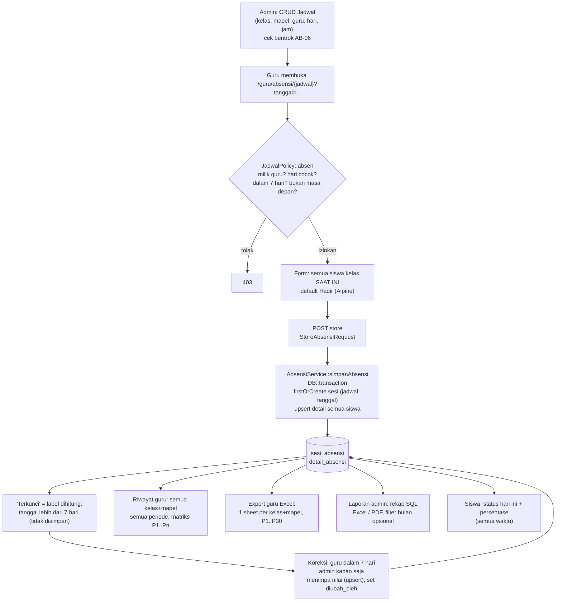

# Audit MyAbsen

Tanggal audit: 2026-10-03 · Auditor: Agent (read-only) · Basis kode: branch `main` @ `b22f385` **ditambah perubahan yang belum di-commit** (lihat T-01).

> Fase ini read-only. Tidak ada file kode, migration, atau data yang diubah. Satu-satunya perintah yang dijalankan selain baca file adalah `php artisan test` (memakai SQLite in-memory, tidak menyentuh MySQL) dan perintah `git` baca-saja.

---

## 1. Ringkasan eksekutif

1. Inti absensi sudah solid: sesi unik per (jadwal, tanggal), default Hadir, simpan dalam satu transaksi, batas koreksi 7 hari ditegakkan di Policy, dan tidak ditemukan celah IDOR di endpoint guru.
2. **Ada tiga rumus persentase yang berbeda** (Service = H+I+S, Riwayat = H saja, Excel guru = H/COUNTA). Pembagi selalu "data yang ada", jadi siswa dengan 1 data dari 8 pertemuan tampil 100%. Ini sesuai teks AB-07 di PRD, tetapi tidak sesuai kebutuhan bisnis. **PRD perlu diputuskan ulang.**
3. Belum ada struktur akademik: tidak ada Tahun Ajaran/Semester (hanya string), tidak ada riwayat keanggotaan kelas, dan tidak ada tabel pengampu. Akibatnya, jika siswa pindah kelas, riwayat dan laporannya ikut salah kelas.
4. "Terkunci" hanya label yang dihitung dari jendela 7 hari. Tidak ada status kunci yang tersimpan dan tidak ada buka kunci manual. Audit trail cuma `diabsen_oleh` dan `diubah_oleh` per sesi, tanpa nilai lama, nilai baru, atau alasan.
5. Performa: halaman Riwayat guru memuat **semua** kombinasi kelas+mapel dan **semua** periode sekaligus, dengan sekitar 7 query per kombinasi. Guru dengan 20 kombinasi bisa memuat sekitar 27 ribu model per semester, dan beban itu terus bertambah tiap semester.
6. Laporan admin bisa diekspor tanpa filter (semua periode, semua kelas). Prosesnya sinkron, tanpa queue dan tanpa batas baris. Untuk PDF, ini rawan timeout atau kehabisan memori.
7. Dashboard admin baru berisi hitungan master data, belum berbasis pengecualian.
8. Risiko proses: pekerjaan export dan riwayat **belum di-commit dan berada langsung di `main`**. Lingkungan test juga rusak (driver `pdo_sqlite` tidak ada: 122 dari 123 test gagal). Saat ini tidak ada jaring pengaman regresi.

---

## 2. Peta arsitektur dan alur data

### 2.1 Stack dan konfigurasi

| Item | Nilai | Bukti |
|---|---|---|
| Framework | Laravel 12, PHP ^8.3, Pest 4 | `composer.json` |
| Paket | maatwebsite/excel ^4.0, barryvdh/laravel-dompdf ^3.1 | `composer.json` |
| Frontend | Blade + Tailwind 3 + Alpine 3 + Vite 6 | `package.json` |
| Queue / Cache / Session | `database` / `database` / `database` (lifetime 120, tidak terenkripsi) | `.env` (hanya nama kunci yang dibaca) |
| Timezone / locale | Asia/Jakarta / id | `config/app.php:68,81` |
| Batas koreksi guru | 7 hari | `config/absensi.php:14` |
| Lazy loading | dicegah di non-produksi | `app/Providers/AppServiceProvider.php:23` |
| Test DB | SQLite `:memory:` | `phpunit.xml:25-26` |

### 2.2 Rute

| Grup | Middleware | Endpoint penting |
|---|---|---|
| `admin.*` | `auth`, `role:admin` | CRUD jurusan/kelas/mapel/guru/siswa/jadwal, `koreksi-absensi`, `laporan`, `laporan/export`, `laporan/export-pdf` (`routes/web.php:26-50`) |
| `guru.*` | `auth`, `role:guru` | `dashboard`, `jadwal`, `koreksi-absensi`, `riwayat`, `laporan/export`, `laporan/export-pdf` (`routes/web.php:53-60`) |
| `guru.absensi.*` | `auth`, `role:guru,admin` | `GET/POST /guru/absensi/{jadwal}` + Policy `absen` (`routes/web.php:63-66`) |
| `siswa.*` | `auth`, `role:siswa` | `dashboard`, `riwayat` (`routes/web.php:69-72`) |

### 2.3 Tabel database

| Tabel | Kolom penting | Constraint / index | Catatan |
|---|---|---|---|
| `users` | name, username (unique), password, role | unique(username) | role enum admin/guru/siswa |
| `jurusan` | nama, kode | - | tanpa soft delete |
| `kelas` | jurusan_id, nama, tingkat, **tahun_ajaran (string)** | FK cascade, soft delete | tahun ajaran hanya teks bebas |
| `guru` | user_id, nip | FK cascade, soft delete | nip tidak unique |
| `siswa` | user_id, **kelas_id**, nis (unique) | index(kelas_id), soft delete | kelas hanya kelas saat ini, tanpa riwayat |
| `mapel` | nama, kode | soft delete | |
| `jadwal` | kelas_id, mapel_id, guru_id, hari, jam_mulai, jam_selesai, tahun_ajaran (string) | index(guru_id,hari), index(kelas_id,hari), FK mapel_id | **tanpa soft delete** (berbeda dari PRD §5) |
| `sesi_absensi` | jadwal_id, tanggal, diabsen_oleh, diubah_oleh, catatan | **unique(jadwal_id,tanggal)**, index(tanggal) | FK user `cascadeOnDelete` |
| `detail_absensi` | sesi_absensi_id, siswa_id, status enum, keterangan | **unique(sesi_absensi_id,siswa_id)**, index(siswa_id) | |

Tidak ada tabel: `tahun_ajaran`, `semester`, `anggota_kelas`, `pengampu`, `hari_libur`, `log_koreksi`.

### 2.4 Lapisan kode yang berhubungan dengan absensi

| Lapisan | File |
|---|---|
| Controller | `Guru/AbsensiController` (dashboard, koreksiAbsensi, show, store, riwayat, export, exportPdf), `Admin/KoreksiAbsensiController`, `Admin/LaporanController`, `Siswa/DashboardController` |
| FormRequest | `Guru/ShowAbsensiRequest`, `Guru/StoreAbsensiRequest`, `ExportLaporanRequest` |
| Policy | `JadwalPolicy::absen` (satu-satunya Policy) |
| Service | `AbsensiService` (696 baris, logika inti + rekap), `LaporanService` (export admin, PDF) |
| Export | `LaporanAbsensiExport` (admin, rekap datar), `LaporanAbsensiGuruExport` → `LaporanAbsensiPerKelasSheet` (guru, matriks P1..P30), `LaporanAbsensiMultiSheetExport` (**stub kosong, tidak dipakai**) |
| View | `guru/absensi`, `guru/riwayat`, `guru/koreksi_absensi`, `guru/jadwal`, `admin/koreksi_absensi/index`, `admin/laporan/index`, `laporan/pdf` |

### 2.5 Alur data saat ini

---

## 3. Hasil audit per checklist

### A. Aturan data absensi

| Poin | Status | Bukti |
|---|---|---|
| Arti sel kosong "-" dibedakan dari Alpa | SEBAGIAN | Alpa tidak pernah disimpan otomatis (AB-02 terpenuhi, `AbsensiService::simpanAbsensi` baris 80 default `hadir`). Tetapi di matriks Riwayat "-" muncul untuk dua kasus yang berbeda tanpa pembeda: siswa yang belum menjadi anggota kelas saat sesi itu, dan baris detail yang hilang (`riwayat.blade.php:150`). **Pertemuan yang belum diabsen sama sekali tidak tampil sebagai kolom**, karena kolom hanya dibentuk dari sesi yang ada (`riwayat.blade.php:118`). Footer menampilkan "-" untuk jumlah 0 (`riwayat.blade.php:187`). |
| Rumus persentase | BELUM (konsisten) | Tiga rumus: (1) `AbsensiService::hitungPersentaseKehadiran` (652-661) = (H+I+S)/data; (2) view Riwayat `riwayat.blade.php:165` = **H/data**; (3) Excel guru `LaporanAbsensiPerKelasSheet::array` baris 170 = **H/COUNTA**. Pembagi selalu jumlah data yang ada, bukan pertemuan yang sudah berlangsung, sehingga kasus 1/8 → 100% terjadi. Untuk rumus (1), perilaku ini sesuai teks AB-07 di `docs/PRD.md:57`. |
| Default semua H saat sesi dibuka | SUDAH | `guru/absensi.blade.php:148,213` (`$defaultStatus = 'hadir'`), backend fallback `AbsensiService.php:80`. |
| Proteksi duplikasi dan constraint unik | SUDAH | `unique(sesi_absensi_id, siswa_id)` di migration detail baris 22; `unique(jadwal_id, tanggal)` di migration sesi baris 23; `lockForUpdate()->firstOrCreate` + `upsert` (`AbsensiService.php:57-98`). |

### B. Struktur akademik

| Poin | Status | Bukti |
|---|---|---|
| Entitas Tahun Ajaran dan Semester | BELUM | Hanya kolom string `kelas.tahun_ajaran` dan `jadwal.tahun_ajaran` (migration kelas baris 19, jadwal baris 22). `sesi_absensi` tidak terikat ke semester. |
| Keanggotaan kelas per tahun ajaran | BELUM | `siswa.kelas_id` ditimpa langsung saat edit (`UpdateSiswaRequest.php:25`). Semua query memakai kelas saat ini: form (`AbsensiService.php:74,110`), Riwayat (`AbsensiController.php:147-151`), Excel (`LaporanAbsensiPerKelasSheet.php:75-81`). Laporan admin join `kelas` lewat `siswa.kelas_id`, bukan `jadwal.kelas_id` (`AbsensiService.php:606`), sehingga absensi lama tercatat di kelas baru. |
| Tabel pengampu guru-kelas-mapel | BELUM | Diturunkan dari `jadwal` (`AbsensiController.php:123-126`, `LaporanAbsensiGuruExport.php:27-30`, `ExportLaporanRequest.php:30-33`). |
| Nomor pertemuan P1..Pn | SEBAGIAN | Dihitung dari indeks urutan sesi pada hasil query (`riwayat.blade.php:120`, `LaporanAbsensiPerKelasSheet.php:113,240`). Nomor berubah jika filter tanggal berubah, tidak di-reset per semester, dan tidak disimpan. Excel memetakan per **tanggal** (`LaporanAbsensiPerKelasSheet.php:131`), jadi dua jadwal kelas+mapel di hari yang sama saling menimpa. |
| Libur, jam kosong, guru berhalangan, pengganti | BELUM | Tidak ada tabel libur atau status sesi. Pertemuan yang tidak terjadi tidak bisa dibedakan dari "lupa diabsen". Guru pengganti di luar MVP (`docs/PRD.md:102`). Admin bisa mengabsen jadwal apa pun, tapi tercatat sebagai `diabsen_oleh` admin. |

### C. Peran dan hak akses

| Poin | Status | Bukti |
|---|---|---|
| Guru hanya melihat/mengubah miliknya | SUDAH (dengan catatan) | Absensi: `JadwalPolicy::absen` baris 41. Riwayat: filter `guru_id` (`AbsensiController.php:124,130`). Export Excel guru: sheet hanya dari jadwal milik guru (`LaporanAbsensiGuruExport.php:28`). PDF guru: `LaporanService::prepareFilters` memaksa `guru_id` (baris 34-37). **Tidak ditemukan IDOR.** Catatan: (1) endpoint `guru.laporan.export` sekarang memakai `Request` mentah tanpa FormRequest/validasi (`AbsensiController.php:170-182`); (2) query detail Excel tidak memfilter `guru_id` (`LaporanAbsensiPerKelasSheet.php:121-127`), sehingga jika dua guru mengampu kelas+mapel yang sama, data guru lain ikut terbaca. |
| Wali Kelas dan Kepala Sekolah | BELUM | Enum role hanya admin/guru/siswa. Tidak ada relasi `kelas.wali_guru_id`. |
| Policy/Gate konsisten | SEBAGIAN | Hanya `JadwalPolicy`. Riwayat dan export memakai filter manual di controller/request. `ExportLaporanRequest::authorize` berisi query otorisasi (baris 22-36). |

### D. Penguncian, koreksi, audit trail

| Poin | Status | Bukti |
|---|---|---|
| Aturan kunci | SEBAGIAN | Otomatis berbasis waktu: guru hanya bisa di hari H sampai H-6 dengan hari yang cocok (`AbsensiService::isTanggalDalamBatasKoreksi` 320-336, `JadwalPolicy` 45-51). Admin bisa kapan saja (baris 30-32). Tidak ada kolom status kunci, tidak ada kunci/buka manual. Label "Terkunci" ada di Riwayat versi `HEAD` dan **hilang** di versi working tree yang belum di-commit. |
| Siapa membuka kunci | BELUM | Tidak ada mekanisme. Admin praktis selalu "terbuka". |
| Log koreksi (siapa, kapan, lama, baru, alasan) | BELUM | Hanya `diabsen_oleh`, `diubah_oleh`, dan `updated_at` per sesi (`AbsensiService.php:63-71`). `upsert` menimpa status tanpa menyimpan nilai lama (baris 94-98). `catatan` ditimpa setiap simpan, termasuk menjadi null. UI menampilkan "user #ID", bukan nama (`guru/absensi.blade.php:97-99`). |

### E. Pelaporan dan export

| Poin | Status | Bukti |
|---|---|---|
| Admin unduh tanpa filter | YA (risiko) | `bulan`, `kelas_id`, dan `mapel_id` semuanya `nullable` (`ExportLaporanRequest.php:49-54`). `getRekapLaporan` tanpa limit (`AbsensiService.php:599-645`). PDF memuat semua baris ke DomPDF (`LaporanService.php:73-93`). |
| Queue dan batas baris | BELUM | Semua `Excel::download` dan `Pdf::download` sinkron. Tidak ada `ShouldQueue`, `FromQuery`, atau chunk. |
| Per semester/rentang bulan, per kelas+mapel per sheet, filter tanggal/hari/bulan/tahun | SEBAGIAN | Guru: per kelas+mapel per sheet SUDAH, rentang tanggal SUDAH (query string), semester BELUM, hari BELUM (dihapus dari UI). Admin: hanya bulan tunggal, satu sheet datar. |
| Rekap per siswa per semester untuk rapor | BELUM | `getRingkasanKehadiranSiswa` dihitung sepanjang masa (`AbsensiService.php:666-694`). Tidak ada konsep semester. |
| NIS sebagai teks di Excel | SEBAGIAN | Guru: diberi prefix spasi `" " . $nis` (`LaporanAbsensiPerKelasSheet.php:146`). Excel menyimpannya sebagai teks, tapi data jadi kotor (spasi di depan) dan format kolom tidak di-set `@`. Admin: NIS ditulis apa adanya (`LaporanAbsensiExport.php:54`), sehingga NIS 12 digit bisa tampil sebagai notasi ilmiah. |

### F. Performa dan skala

| Poin | Status | Bukti |
|---|---|---|
| N+1 / query per loop | SEBAGIAN | `AbsensiController::riwayat` menjalankan query di dalam `map` per kombinasi: `pluck` jadwal, sesi, detail, siswa, user, ditambah eager siswa.user (baris 129-158). Sekitar 7 query × 20 kombinasi ≈ 140 query. Lainnya sudah eager loading. |
| Full scan | ADA | `whereYear/whereMonth(tanggal)` non-sargable sehingga index `sesi_absensi(tanggal)` tidak terpakai (`AbsensiService.php:258-259, 619-620`, `LaporanAbsensiPerKelasSheet.php:103-104`). Query detail Excel tanpa filter tanggal (baris 121-127). |
| Index yang diminta | Lihat tabel 3.F.1 | |
| Riwayat memuat semua kombinasi sekaligus | YA | `AbsensiController.php:123-158` + seluruh periode jika tanggal kosong (default). |
| Pagination / lazy load / cache | SEBAGIAN | Pagination ada di CRUD admin (10/hal) dan riwayat siswa (15/hal). Riwayat guru, laporan, dan export tanpa pagination. Tidak ada `Cache::` di `app/`. |

#### 3.F.1 Index

| Index yang dicek | Ada? | Keterangan |
|---|---|---|
| `detail_absensi(sesi_absensi_id, siswa_id)` | Ada (unique) | Juga melayani lookup per sesi. |
| `detail_absensi(siswa_id)` | Ada | Rekap per siswa. Sebaiknya komposit `(siswa_id, sesi_absensi_id)` atau `(siswa_id, status)` untuk covering. |
| `sesi_absensi(jadwal_id, tanggal)` | Ada (unique) | Bagus untuk rentang tanggal per jadwal. |
| `(kelas_id, tanggal)` | **Tidak ada** | `sesi_absensi` tidak punya `kelas_id`, jadi query per kelas harus join `jadwal`. Perlu dipertimbangkan denormalisasi `kelas_id`/`semester_id` ke `sesi_absensi` + index `(kelas_id, tanggal)`. |
| `jadwal(guru_id)` | Ada (prefix `guru_id,hari`) | |
| `jadwal(mapel_id)` | Ada (FK otomatis MySQL) | Kurang `(guru_id, kelas_id, mapel_id)` untuk lookup kombinasi, tetapi tabel jadwal kecil (sekitar 500 baris), jadi dampaknya rendah. |

#### 3.F.2 Uji beban tertulis (analisis, tanpa eksekusi)

Asumsi: 850 siswa, 24 kelas (rata-rata 36 siswa), sekitar 3.800 sesi dan 130 ribu detail per semester. MySQL 8 InnoDB di server kelas menengah (SSD, buffer pool ≥ 512 MB). Angka di bawah adalah perkiraan orde besaran.

| Skenario | Baris disentuh | Perkiraan | Catatan |
|---|---|---|---|
| Simpan 1 sesi (36 siswa) | 1 sesi + 36 upsert | < 50 ms | Aman. |
| Riwayat guru, 20 kombinasi, 1 semester, tanpa filter | ±140 query; ±760 sesi; ±27.000 detail di-hydrate sebagai Eloquent + ±720 siswa + user | Query 0,3-1 s; hydrate + render Blade 27 ribu sel **2-6 s**; memori 60-120 MB; HTML ±5-8 MB | Bertambah linear tiap semester. Setelah 2-3 tahun berisiko melewati `memory_limit` 128 MB dan sangat berat di HP. |
| Riwayat guru, 1 kombinasi, 1 semester | ±40 sesi; ±1.400 detail | < 150 ms | Target desain Fase 3. |
| Laporan admin, filter 1 bulan, semua kelas | `whereMonth` scan ±7.600 sesi/tahun, lalu ±22.000 detail; GROUP BY 5 kolom | 0,2-0,6 s | Temp table + filesort. |
| Laporan admin tanpa filter, 1 tahun | ±260.000 detail, ±12.750 baris hasil (850 siswa × ±15 mapel) | SQL 1-3 s; Excel 5-15 s | Tumbuh tiap tahun (3 tahun ≈ 800 ribu detail). |
| PDF admin tanpa filter | ±12.750 baris tabel di DomPDF | **> 60 s / out of memory** | Risiko kritis untuk timeout PHP dan nginx. |
| Excel guru, 20 sheet | 20 × query detail **seluruh riwayat** kelas+mapel + 1.080 DataValidation clone per sheet | 5-20 s | Perlu filter tanggal di query detail dan validasi per range. |

### G. Pengalaman pengguna

| Poin | Status | Bukti |
|---|---|---|
| Klik input absensi | SUDAH (efisien) | Dashboard → kartu jadwal → Simpan = 2-3 klik bila semua hadir. Ubah hanya yang tidak hadir (radio per siswa) sudah ada. Tombol "Tandai semua hadir" eksplisit tidak ada (tidak diperlukan karena default H), tapi tombol "reset ke H" berguna saat koreksi. Setelah simpan, guru dialihkan ke dashboard (`AbsensiController.php:106`), bukan kembali ke halaman asal. |
| Dashboard admin berbasis pengecualian | BELUM | Hanya `Siswa::count()`, `Guru::count()`, dan sejenisnya (`Admin/DashboardController.php:19-22`). |
| Kolom NIS/Nama bertumpuk | BELUM DIPERBAIKI | Kolom sticky memakai offset tetap `left-8` dan `left-[10rem]` (`riwayat.blade.php:115-117,139-141`), sementara tabel `min-width:max-content` dan `px-3` membuat lebar nyata kolom No/NIS lebih besar dari offset. Akibatnya kolom Nama menimpa NIS. |
| Nomor urut acak (6,1,5,2,3,4) | BELUM DIPERBAIKI | `sortBy('user.name')` mempertahankan key asli (`AbsensiController.php:151`), lalu view memakai key sebagai nomor `{{ $no + 1 }}` (`riwayat.blade.php:134,139`). Perlu `->values()` atau `$loop->iteration`. |
| Kolom tanpa data tampil "-" | SEBAGIAN | Lihat poin A. Legenda "— = Belum diabsen" (`riwayat.blade.php:202`) menyesatkan karena "-" sebenarnya berarti "bukan anggota/tidak ada baris". |

### H. Keamanan dan kualitas

| Poin | Status | Bukti |
|---|---|---|
| Validasi input | SEBAGIAN | Absensi dan CRUD memakai FormRequest. Export guru tanpa validasi (`AbsensiController.php:177`). |
| CSRF | SUDAH | Semua form `POST` punya `@csrf` (dicek otomatis di seluruh `resources/views`). |
| Mass assignment | SUDAH | Semua model memakai `$fillable`. `role` fillable di `User`, tetapi hanya diisi oleh controller admin. |
| Rate limit login | SUDAH | 5 percobaan per username+IP (`LoginRequest.php:45-105`) + test AB-10. |
| Password | SEBAGIAN | Hash bcrypt (cast `hashed`). Tetapi **semua akun baru dan reset memakai password `password`** (`GuruController.php:46,110`, `SiswaController.php:54,116`, `SiswaImport.php:28`), tanpa wajib ganti saat login pertama. |
| Data pribadi siswa | SEBAGIAN | Akses dibatasi role. `SESSION_ENCRYPT=false`, `APP_DEBUG=true` (lokal, harus false di produksi). Belum ada kebijakan retensi. |
| Integritas FK | RISIKO | `sesi_absensi.diabsen_oleh/diubah_oleh` memakai `cascadeOnDelete`, jadi menghapus user menghapus sesi (migration sesi 18-19). Kelas/Mapel di-soft-delete tanpa cek (`KelasController.php:67-72`, `MapelController.php:55-60`), lalu `$jadwal->kelas->nama` menjadi null dan menyebabkan error 500 di 13 tempat di view guru/jadwal. |
| Cakupan test | SEBAGIAN | 123 test (AB-01..04, 05, 07, 08, 09, 10, laporan). **Tidak ada test** untuk: Riwayat guru (matriks), `LaporanAbsensiGuruExport`/`PerKelasSheet`, AB-06 di format Pest (ada di class `JadwalTest`), soft delete kelas/mapel. Test `LaporanTest > guru tidak bisa mengekspor kelas yang bukan diampunya` kemungkinan gagal karena export guru tidak lagi memakai `ExportLaporanRequest`. |
| Lingkungan test | RUSAK | `php artisan test` → 122 gagal "could not find driver" (SQLite). PHP lokal hanya punya `pdo_mysql` (`php -m`). |

---

## 4. Tabel temuan

| ID | Area | Temuan | Bukti | Dampak | Tingkat | Rekomendasi |
|---|---|---|---|---|---|---|
| T-01 | H | Pekerjaan export/riwayat belum di-commit dan berada langsung di `main` (4 file M, 3 file baru) | `git status` | Melanggar aturan Git di AGENTS.md; rawan hilang dan tidak bisa di-review | Kritis | Pindahkan ke branch `fitur/riwayat-export`, commit, lalu buka PR |
| T-02 | H | Lingkungan test rusak (driver sqlite tidak ada) | `phpunit.xml:25-26`, `php -m` | Tidak ada jaring pengaman regresi untuk semua fase berikutnya | Kritis | Aktifkan `pdo_sqlite` di php.ini Laragon, atau pakai DB MySQL khusus test (`myabsen_test`) |
| T-03 | A | Tiga rumus persentase berbeda | `AbsensiService.php:652-661`, `riwayat.blade.php:165`, `LaporanAbsensiPerKelasSheet.php:170` | Angka berbeda antara layar, Excel, dan siswa, sehingga kepercayaan guru turun | Kritis | Satu sumber: `AbsensiService` (atau `RekapKehadiranService`). View dan Excel hanya menampilkan hasil |
| T-04 | A | Pembagi = data yang ada, bukan pertemuan yang berlangsung (1/8 → 100%) | `docs/PRD.md:57`, `AbsensiService.php:205,637` | Persentase menyesatkan untuk siswa baru/pindahan; tidak bisa dipakai untuk rapor | Tinggi | Putuskan di PRD (lihat Q-02). Usulan: pembagi = sesi kelas+mapel yang terlaksana selama siswa terdaftar |
| T-05 | A/G | Pertemuan yang belum diabsen tidak tampil di matriks; "-" ambigu | `riwayat.blade.php:118,150,202` | Guru/admin tidak tahu pertemuan mana yang terlewat | Tinggi | Bangun kolom dari kalender jadwal (tanggal seharusnya) dan bedakan: "Belum diabsen", "Bukan anggota", "Libur" |
| T-06 | B | Tidak ada Tahun Ajaran/Semester; sesi tidak terikat semester | migration kelas:19, jadwal:22 | Tidak bisa rekap per semester/rapor; data lintas tahun tercampur | Tinggi | Tabel `tahun_ajaran`, `semester` (tanggal mulai/selesai, aktif), `sesi_absensi.semester_id` |
| T-07 | B | Kelas siswa ditimpa langsung; laporan join `siswa.kelas_id` | `UpdateSiswaRequest.php:25`, `AbsensiService.php:606`, `AbsensiController.php:147` | Saat naik/pindah kelas, riwayat lama hilang dari kelas asal dan laporan salah kelas | Tinggi | Tabel `anggota_kelas(siswa_id, kelas_id, tahun_ajaran_id, mulai, selesai)`; laporan join `jadwal.kelas_id` |
| T-08 | B | Tidak ada tabel pengampu | `AbsensiController.php:123-126` | Otorisasi dan daftar kombinasi bergantung pada jadwal; jadwal dobel per minggu menjadi ambigu | Sedang | Tabel `pengampu(guru_id, kelas_id, mapel_id, semester_id)`; `jadwal.pengampu_id` |
| T-09 | B | Excel memetakan status per tanggal | `LaporanAbsensiPerKelasSheet.php:113,131` | Dua jadwal kelas+mapel di hari sama saling menimpa; kolom ganda | Sedang | Petakan per `sesi_id` (seperti view) |
| T-10 | B | P1..Pn tidak stabil (bergantung filter) | `riwayat.blade.php:120` | P5 di layar bisa berbeda dengan P5 di Excel atau periode lain | Sedang | Nomor pertemuan dihitung per (pengampu, semester) secara berurutan tanggal; bisa disimpan di `sesi_absensi.pertemuan_ke` |
| T-11 | D | Tidak ada log koreksi (nilai lama/baru, alasan) | `AbsensiService.php:63-98` | Tidak bisa ditelusuri jika ada sengketa nilai/kehadiran | Tinggi | Tabel `log_koreksi_absensi`; alasan wajib saat koreksi setelah sesi pertama |
| T-12 | D | Kunci hanya label waktu; tidak ada buka kunci manual | `AbsensiService.php:320-336`, `JadwalPolicy.php:30-51` | Guru yang terlambat > 7 hari harus minta admin mengabsen atas nama admin | Sedang | Kolom `dikunci_pada` + tabel/flag `buka_kunci` oleh admin dengan masa berlaku |
| T-13 | C | Query detail Excel tidak memfilter guru | `LaporanAbsensiPerKelasSheet.php:121-127` | Jika dua guru mengampu kelas+mapel sama, data guru lain bocor ke Excel | Sedang | Tambah `where jadwal.guru_id` + filter tanggal |
| T-14 | C | Export guru memakai `Request` tanpa FormRequest | `AbsensiController.php:170-182` | Input tidak divalidasi; pola tidak konsisten dengan AGENTS.md | Sedang | Kembalikan ke FormRequest khusus export guru + Policy `RiwayatPolicy`/`PengampuPolicy` |
| T-15 | C | Belum ada role Wali Kelas dan Kepala Sekolah | enum `users.role` | Kebutuhan pemantauan read-only tidak terlayani | Sedang | Tambah role `kepsek` (read-only global) dan relasi `kelas.wali_guru_id` (guru + hak lihat kelas walian) |
| T-16 | E | Export admin tanpa filter wajib, tanpa queue/batas | `ExportLaporanRequest.php:49-54`, `LaporanService.php:57-94` | PDF semua periode bisa timeout atau OOM; beban server | Tinggi | Wajib pilih semester atau rentang ≤ 6 bulan; export besar lewat queue (`ShouldQueue` + notifikasi unduh); PDF dibatasi per kelas |
| T-17 | E | Tidak ada rekap per siswa per semester (rapor) | `AbsensiService.php:666-694` | Wali kelas harus menghitung manual | Sedang | Rekap H/I/S/A per siswa per semester (lintas mapel) + export |
| T-18 | E | NIS di Excel admin numerik; di Excel guru diberi prefix spasi | `LaporanAbsensiExport.php:54`, `LaporanAbsensiPerKelasSheet.php:146` | Notasi ilmiah / data kotor | Rendah | `setCellValueExplicit(..., DataType::TYPE_STRING)` + format `@` |
| T-19 | F | Riwayat guru memuat semua kombinasi dan semua periode, N+1 per kombinasi | `AbsensiController.php:123-158` | 2-6 s dan 60-120 MB per buka; memburuk tiap semester | Tinggi | Satu kombinasi per tampilan, default semester aktif, agregasi via SQL, 1 query detail ber-index |
| T-20 | F | `whereYear/whereMonth` non-sargable | `AbsensiService.php:258,619`, `LaporanAbsensiPerKelasSheet.php:103` | Index `tanggal` tidak terpakai | Sedang | Ganti dengan `whereBetween('tanggal', [awal, akhir])` |
| T-21 | F | Tidak ada index `(kelas_id, tanggal)` atau `semester_id` pada sesi | migration sesi:23-24 | Laporan per kelas wajib join jadwal | Rendah | Saat Fase 2: `sesi_absensi(semester_id, jadwal_id, tanggal)`; opsional `kelas_id` denormalisasi |
| T-22 | G | Nomor urut siswa acak | `AbsensiController.php:151`, `riwayat.blade.php:139` | Membingungkan, terlihat seperti bug | Sedang | `->values()` atau `$loop->iteration`; urutkan di SQL (`orderBy users.name`) |
| T-23 | G | Kolom sticky NIS/Nama bertumpuk | `riwayat.blade.php:115-117,139-141` | Tidak terbaca di layar | Sedang | Lebar tetap (`min-w`/`max-w` sama dengan offset) atau gabungkan NIS di bawah nama dalam satu kolom sticky |
| T-24 | G | Dashboard admin hanya hitungan master | `Admin/DashboardController.php:17-30` | Admin tidak tahu sesi mana yang belum diisi atau siswa mana yang sering Alpa | Sedang | Widget: sesi belum diisi hari ini/minggu ini, siswa Alpa ≥ ambang, 5 kelas kehadiran terendah |
| T-25 | G | Setelah simpan dialihkan ke dashboard; log menampilkan "user #ID" | `AbsensiController.php:106`, `guru/absensi.blade.php:97-99` | Alur koreksi beruntun lambat; info tidak manusiawi | Rendah | Redirect `back()`/ke asal; tampilkan nama user |
| T-26 | H | Password default `password` untuk semua akun dan reset | `GuruController.php:46,110`, `SiswaController.php:54,116`, `SiswaImport.php:28` | Akun mudah diambil alih (siswa bisa login sebagai teman via NIS) | Tinggi | Password awal acak/berbasis tanggal lahir + wajib ganti saat login pertama |
| T-27 | H | Soft delete Kelas/Mapel tanpa cek, view memanggil `->kelas->nama` tanpa null-safe | `KelasController.php:67-72`, `MapelController.php:55-60` | Error 500 di Riwayat/Jadwal setelah kelas/mapel dihapus | Tinggi | Relasi `->withTrashed()` di `Jadwal::kelas/mapel`; cegah hapus jika ada jadwal aktif |
| T-28 | H | FK `diabsen_oleh/diubah_oleh` `cascadeOnDelete` | migration sesi:18-19 | Menghapus user menghapus sesi beserta detail absensinya | Sedang | Migration baru: ubah ke `restrictOnDelete`/`nullOnDelete` |
| T-29 | H | `jadwal` tanpa soft delete (berbeda dari PRD §5) | migration jadwal | Saat ini terlindungi oleh cek di `JadwalController::destroy`, tetapi skema tidak sesuai PRD | Rendah | Tambah `softDeletes` lewat migration baru atau perbarui PRD |
| T-30 | H | File mati/stub: `LaporanAbsensiMultiSheetExport`, `getRiwayatSesi`, route `guru.laporan.exportPdf` tanpa UI | `app/Exports/LaporanAbsensiMultiSheetExport.php`, `AbsensiService.php:228`, `routes/web.php:59` | Kebingungan pemeliharaan | Rendah | Hapus atau pakai kembali secara sadar |

---

## 5. Pertanyaan bisnis untuk pemilik aplikasi

| ID | Pertanyaan | Rekomendasi jawaban default |
|---|---|---|
| Q-01 | Sel kosong berarti apa: Alpa atau belum diabsen? | **Belum diabsen** (sesuai AB-02). Ditampilkan sebagai "·" abu-abu dengan legenda jelas, tidak dihitung dalam persentase, tetapi muncul di daftar "sesi belum diisi" untuk ditindaklanjuti. |
| Q-02 | Penyebut persentase: semua pertemuan yang sudah berlangsung atau hanya data yang ada? | **Pertemuan yang terlaksana (punya sesi) selama siswa terdaftar di kelas itu.** Siswa tanpa baris di sesi yang terlaksana dihitung "belum diabsen" dan ditandai, bukan diabaikan. Butuh perubahan AB-07 di PRD. |
| Q-03 | Izin dan Sakit dihitung hadir? | Pertahankan AB-07: H+I+S dihitung "tidak bolos" untuk **persentase kehadiran**, tetapi tampilkan juga "persentase hadir murni" (H saja) untuk rapor jika sekolah membutuhkan. |
| Q-04 | Kapan sesi terkunci? | Otomatis **H+7 hari** (sudah berjalan). Tambahan: terkunci permanen saat semester ditutup. |
| Q-05 | Siapa yang boleh membuka kunci? | **Admin/Kurikulum**, per sesi atau per guru, berlaku 48 jam, dengan alasan wajib dan tercatat di log. |
| Q-06 | Berapa pertemuan standar per semester? | Dihitung otomatis dari kalender: jumlah minggu efektif × frekuensi jadwal per minggu (±18 minggu). Excel tetap menyediakan 30 kolom. |
| Q-07 | Bagaimana libur nasional dan kegiatan sekolah? | Admin mengisi **kalender libur** per semester. Tanggal libur tidak dihitung sebagai pertemuan dan tidak muncul sebagai "belum diabsen". |
| Q-08 | Guru berhalangan dan guru pengganti? | Fase awal: admin bisa mengabsen atas nama jadwal (sudah bisa), dengan catatan "diabsen oleh pengganti". Fitur pengganti penuh tetap di luar MVP. |
| Q-09 | Siswa pindah kelas di tengah semester: riwayat ikut siapa? | Riwayat tetap di kelas asal pada periode itu. Persentase per kelas+mapel dihitung hanya selama keanggotaan. |
| Q-10 | Apakah koreksi wajib menyertakan alasan? | **Ya** untuk koreksi setelah penyimpanan pertama. Simpan pertama tidak perlu alasan. |
| Q-11 | Wali Kelas boleh mengubah absensi? | **Tidak**, hanya melihat seluruh mapel di kelas walian dan mengunduh rekap rapor. |
| Q-12 | Kepala Sekolah/Kurikulum boleh apa? | Read-only semua kelas, dashboard pengecualian, dan unduh laporan. Kurikulum juga boleh membuka kunci (lihat Q-05). |
| Q-13 | Ambang peringatan Alpa? | **3 Alpa per mapel** atau **kehadiran < 75%** per semester → masuk daftar pantauan wali kelas/BK. |
| Q-14 | Export: rentang maksimum? | Satu semester per unduhan. Lebih dari itu diproses lewat queue dan diberi notifikasi. |
| Q-15 | Password awal siswa/guru? | Acak 8 karakter dan dicetak oleh admin, atau tanggal lahir (DDMMYYYY), dengan wajib ganti saat login pertama. |
| Q-16 | Apakah halaman siswa tetap ada? (Konteks bisnis hanya menyebut Admin dan Guru) | Pertahankan, karena PRD dan kode sudah mendukung, dan risikonya rendah. |
